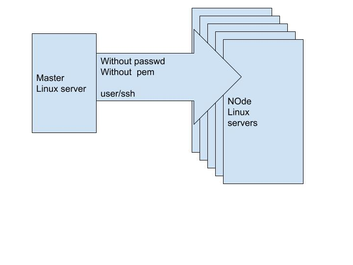

# i  want to login one  linux server into  other linux servers  with out pem file  with out passwd.




## On master Server: Stage1

```
 # adduser maha
 # visudo
   maha    ALL=(ALL)     NOPASSWD: ALL

  :wq!

 # vi /etc/ssh/sshd_config
   PasswordAuthentication yes

  :wq!

  # service  ssh restart

```


## On node Server: Stage2

```
 # adduser maha
 # visudo
   maha    ALL=(ALL)     NOPASSWD: ALL

  :wq!

 # vi /etc/ssh/sshd_config
   PasswordAuthentication yes

  :wq!

  # service  ssh restart

```

## On master : stage 3

```
# ssh-keygen
# ssh-copy-id <your node private ip>

```